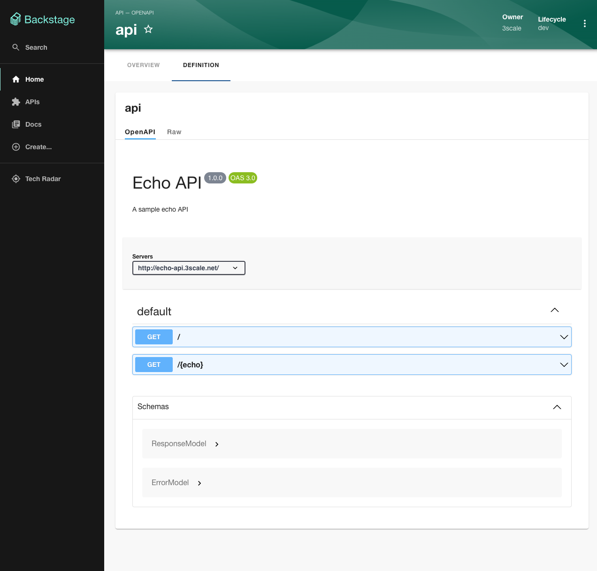

# [Backstage](https://backstage.io)

This is your newly scaffolded Backstage App, Good Luck!

To start the app, run:

```sh
yarn install
yarn dev
```

# Kubernetes Plugin

Create a new service account in the kube-system namespace

```
kubectl -n kube-system create serviceaccount backstage-admin
```

Create a clusterrolebinding

```
kubectl create clusterrolebinding backstage-admin --clusterrole=cluster-admin --serviceaccount=kube-system:backstage-admin
```

Create a secret for the service account

```
kubectl apply -f - <<EOF
apiVersion: v1
kind: Secret
metadata:
  name: backstage-admin
  namespace: kube-system
  annotations:
    kubernetes.io/service-account.name: backstage-admin
type: kubernetes.io/service-account-token
EOF
```

Get the token

```
export TOKEN=$(kubectl -n kube-system get secret backstage-admin -o jsonpath='{.data.token}' | base64 --decode)
```

Run a sanity check (change `192.168.2.151:16443` with your Kube API Server address)
```
curl -k -H "Authorization: Bearer $TOKEN" -X GET "https://192.168.2.151:16443/api/v1/nodes" | json_pp
```

Go to `app-config.yaml` and start changing stuff under `kubernetes`:
  * Update `url` with your API Server address
  * Update `name` with your choice (it will be shown in Backstage UI)
  * Update `serviceAccountToken` with the token you got from the previous step
  * Update `dashboardUrl` if you enabled Kubernetes dashboard on your Kube cluster
  * Leave `customResources` as is (will be used by Tekton plugin later on)

Now, run!

```
yarn install
yarn dev
```

You won't see sh*t yet. You need to create a bunch of resources first!

Go to http://localhost:3000/catalog

Press "Create" and then "Register Existing Component". Give `https://github.com/aliok/test-backstage-kubernetes-component/blob/main/catalog-info.yaml` as the URL.

Go to http://localhost:3000/catalog/default/component/test-backstage-kubernetes-component

You should see a `Kubernetes` tab. It won't show shite yet.

See `https://github.com/aliok/test-backstage-kubernetes-component/blob/main/catalog-info.yaml`
    * It has `backstage.io/kubernetes-id: test-backstage-kubernetes-component` annotation
    * Backstage will look for Kubernetes resources with label `backstage.io/kubernetes-id: test-backstage-kubernetes-component`

Let's create a resource that are associated to that Backstage component:

```
kubectl apply -f - <<EOF
apiVersion: apps/v1
kind: Deployment
metadata:
  name: test-backstage-kubernetes-component
  labels:
    backstage.io/kubernetes-id: test-backstage-kubernetes-component
spec:
  replicas: 3
  selector:
    matchLabels:
      app: test-backstage-kubernetes-component
  template:
    metadata:
      labels:
        app: test-backstage-kubernetes-component
        backstage.io/kubernetes-id: test-backstage-kubernetes-component
    spec:
      containers:
      - name: ubuntu
        image: ubuntu
        command:
        - /bin/sh
        args:
        - -c
        - "tail -f /dev/null"
EOF
```

Now, you should see a deployment in the Kubernetes tab.


# Tekton Plugin

Install Tekton in your Kube cluster first:
```
kubectl apply --filename https://storage.googleapis.com/tekton-releases/pipeline/latest/release.yaml
```

You need the Kubernetes plugin configured as above.

Then, make sure you have these in `app-config.yaml`:
```yaml
          customResources:
            - group: 'tekton.dev'
              apiVersion: 'v1beta1'
              plural: 'pipelineruns'
            - group: 'tekton.dev'
              apiVersion: 'v1beta1'
              plural: 'taskruns'
```

Also, `https://github.com/aliok/test-backstage-kubernetes-component/blob/main/catalog-info.yaml` already has `janus-idp.io/tekton-enabled : 'true'` in it.

Then, create the following resources, which have proper labels.

```
kubectl apply -f - <<EOF
apiVersion: tekton.dev/v1beta1
kind: Task
metadata:
  name: hello
  labels:
    backstage.io/kubernetes-id: test-backstage-kubernetes-component
spec:
  steps:
    - name: echo
      image: alpine
      script: |
        #!/bin/sh
        echo "Hello World"
EOF

kubectl apply -f - <<EOF
apiVersion: tekton.dev/v1beta1
kind: TaskRun
metadata:
  name: hello-task-run
  labels:
      backstage.io/kubernetes-id: test-backstage-kubernetes-component
spec:
  taskRef:
    name: hello
EOF

kubectl apply -f - <<EOF
apiVersion: tekton.dev/v1beta1
kind: Task
metadata:
  name: goodbye
  labels:
    backstage.io/kubernetes-id: test-backstage-kubernetes-component
spec:
  params:
  - name: username
    type: string
  steps:
    - name: goodbye
      image: ubuntu
      script: |
        #!/bin/bash
        echo "Goodbye dude!"
EOF

kubectl apply -f - <<EOF
apiVersion: tekton.dev/v1beta1
kind: Pipeline
metadata:
  name: hello-goodbye
  labels:
      backstage.io/kubernetes-id: test-backstage-kubernetes-component
spec:
  params:
  - name: username
    type: string
  tasks:
    - name: hello
      taskRef:
        name: hello
    - name: goodbye
      runAfter:
        - hello
      taskRef:
        name: goodbye
      params:
      - name: username
        value: asdasd
EOF

kubectl apply -f - <<EOF
apiVersion: tekton.dev/v1beta1
kind: PipelineRun
metadata:
  name: hello-goodbye-run
  labels:
        backstage.io/kubernetes-id: test-backstage-kubernetes-component
spec:
  pipelineRef:
    name: hello-goodbye
  params:
  - name: username
    value: "Tekton"
EOF
```

Tekton pipeline will only show the `PipelineRun`s (I think).


and


# Custom blank plugin

When you go to http://localhost:3000/aliok-test-01 you will see the plugin from the Backstage tutorial.


# 3scale plugin

Install the plugin:
```shell
yarn workspace backend add @janus-idp/backstage-plugin-3scale-backend
```

Enable the plugin by making sure you have these in `app-config.yaml`:
```yaml
catalog:
  providers:
    threeScaleApiEntity:
      dev:
        baseUrl: https://<TENANT>-admin.3scale.net
        accessToken: <ACCESS_TOKEN>
        schedule: # optional; same options as in TaskScheduleDefinition
          # supports cron, ISO duration, "human duration" as used in code
          frequency: { minutes: 1 }
          # supports ISO duration, "human duration" as used in code
          timeout: { minutes: 1 }
```

and having the entity provider in `packages/backend/src/plugins/catalog.ts`:
```typescript
import { ThreeScaleApiEntityProvider } from '@janus-idp/backstage-plugin-3scale-backend';

...

builder.addEntityProvider(
    ThreeScaleApiEntityProvider.fromConfig(env.config, {
      logger: env.logger,
      scheduler: env.scheduler,
    }),
  );
```

Screenshots:


---

---

---


